# Sasya Arogya - Grand Architecture Diagram

## Complete System Architecture

```mermaid
graph TB
    %% Styling
    classDef uiClass fill:#e1f5fe,stroke:#01579b,stroke-width:2px,color:#000
    classDef agentClass fill:#f3e5f5,stroke:#4a148c,stroke-width:2px,color:#000
    classDef mlClass fill:#e8f5e8,stroke:#1b5e20,stroke-width:2px,color:#000
    classDef ragClass fill:#fff3e0,stroke:#e65100,stroke-width:2px,color:#000
    classDef mcpClass fill:#fce4ec,stroke:#880e4f,stroke-width:2px,color:#000
    classDef llmClass fill:#f1f8e9,stroke:#33691e,stroke-width:2px,color:#000
    classDef dataClass fill:#f5f5f5,stroke:#424242,stroke-width:2px,color:#000
    classDef infraClass fill:#e3f2fd,stroke:#0d47a1,stroke-width:2px,color:#000

    %% UI Layer
    subgraph UI["🎨 User Interface Layer"]
        direction TB
        AndroidApp["📱 Android App<br/>(Kotlin/Java)"]
        ChatUI["💬 Chat Interface<br/>(FSM-driven)"]
        CameraUI["📷 Camera Capture<br/>(Disease Detection)"]
        InsuranceUI["🛡️ Insurance Portal<br/>(Claims & Certificates)"]
        ProfileUI["👤 Agricultural Profile<br/>(Crop & Location Data)"]
    end

    %% API Gateway & Load Balancer
    subgraph Gateway["🌐 API Gateway Layer"]
        LoadBalancer["⚖️ Load Balancer<br/>(NGINX/HAProxy)"]
        APIGateway["🚪 API Gateway<br/>(FastAPI Router)"]
        AuthService["🔐 Authentication<br/>(JWT/OAuth)"]
        RateLimit["🚦 Rate Limiting<br/>(Redis-based)"]
    end

    %% Core Agent System
    subgraph Agent["🤖 LangGraph FSM Agent Core"]
        direction TB
        
        %% State Machine
        subgraph StateMachine["🔄 State Machine Transitions"]
            InitState["🏁 Initial State<br/>(Welcome)"]
            IntentState["🎯 Intent Analysis<br/>(Classification)"]
            DiseaseState["🦠 Disease Detection<br/>(Image Processing)"]
            PrescriptionState["💊 Prescription<br/>(RAG-based)"]
            InsuranceState["🛡️ Insurance<br/>(MCP Integration)"]
            CropCareState["🌱 General Crop Care<br/>(Knowledge Base)"]
            FinalState["✅ Response Generation<br/>(LLM Synthesis)"]
        end
        
        %% Agent Components
        AgentOrchestrator["🎼 Agent Orchestrator<br/>(LangGraph)"]
        ContextManager["📋 Context Manager<br/>(Session State)"]
        WorkflowEngine["⚙️ Workflow Engine<br/>(Node Execution)"]
    end

    %% ML/AI Processing Layer
    subgraph ML["🧠 ML/AI Processing Layer"]
        direction TB
        
        %% CNN Classification
        subgraph CNN["🔬 CNN Disease Classification"]
            ImagePreprocess["🖼️ Image Preprocessing<br/>(Resize, Normalize)"]
            CNNModel["🧬 CNN Model<br/>(ResNet/EfficientNet)"]
            ConfidenceScore["📊 Confidence Scoring<br/>(Threshold: 85%)"]
        end
        
        %% LLM Services
        subgraph LLM["🧠 LLM Services"]
            OllamaService["🦙 Ollama Service<br/>(Llama 3.1 8B)"]
            LlavaVision["👁️ LLaVA Vision<br/>(Multimodal Analysis)"]
            EmbeddingService["🔤 Embedding Service<br/>(Text Vectorization)"]
        end
    end

    %% RAG System
    subgraph RAG["📚 Prescription RAG System"]
        direction TB
        VectorDB["🗃️ Vector Database<br/>(ChromaDB)"]
        KnowledgeBase["📖 Knowledge Base<br/>(Agricultural Prescriptions)"]
        Retriever["🔍 Document Retriever<br/>(Similarity Search)"]
        Generator["✍️ Response Generator<br/>(Context-aware)"]
    end

    %% MCP Insurance System
    subgraph MCP["🛡️ MCP Insurance Server"]
        direction TB
        MCPServer["🖥️ MCP Server<br/>(Insurance Integration)"]
        ClaimsProcessor["📋 Claims Processor<br/>(Automated Assessment)"]
        CertificateGen["📜 Certificate Generator<br/>(PDF/Digital)"]
        InsuranceDB["🗄️ Insurance Database<br/>(Policies & Claims)"]
    end

    %% Data & Storage Layer
    subgraph Data["💾 Data & Storage Layer"]
        direction TB
        PostgresDB["🐘 PostgreSQL<br/>(User Data & Sessions)"]
        RedisCache["⚡ Redis Cache<br/>(Session & Rate Limiting)"]
        S3Storage["☁️ Object Storage<br/>(Images & Documents)"]
        MLflowTracking["📈 MLflow Tracking<br/>(Model Versioning)"]
    end

    %% Monitoring & Observability
    subgraph Monitoring["📊 Monitoring & Observability"]
        direction TB
        Prometheus["📊 Prometheus<br/>(Metrics Collection)"]
        Grafana["📈 Grafana<br/>(Dashboards)"]
        Jaeger["🔍 Jaeger<br/>(Distributed Tracing)"]
        AlertManager["🚨 Alert Manager<br/>(Notifications)"]
    end

    %% Infrastructure Layer
    subgraph Infrastructure["🏗️ Infrastructure Layer"]
        direction TB
        
        subgraph Clusters["☁️ OpenShift Clusters"]
            GPUCluster["🚀 GPU Cluster<br/>(engine-sasya-chikitsa)<br/>cluster-mqklc.sandbox601"]
            NonGPUCluster["⚡ Non-GPU Cluster<br/>(engine-sasya-arogya)<br/>cluster-dg9gp.sandbox1039"]
        end
        
        Docker["🐳 Docker<br/>(Containerization)"]
        Kubernetes["☸️ Kubernetes<br/>(Orchestration)"]
    end

    %% Connections - UI to Gateway
    AndroidApp --> LoadBalancer
    ChatUI --> APIGateway
    CameraUI --> APIGateway
    InsuranceUI --> APIGateway
    ProfileUI --> APIGateway

    %% Gateway Layer Connections
    LoadBalancer --> APIGateway
    APIGateway --> AuthService
    APIGateway --> RateLimit
    APIGateway --> AgentOrchestrator

    %% Agent State Machine Flow
    AgentOrchestrator --> InitState
    InitState --> IntentState
    IntentState --> DiseaseState
    IntentState --> CropCareState
    IntentState --> InsuranceState
    DiseaseState --> PrescriptionState
    PrescriptionState --> FinalState
    CropCareState --> FinalState
    InsuranceState --> FinalState
    
    %% Agent Internal Connections
    AgentOrchestrator --> ContextManager
    AgentOrchestrator --> WorkflowEngine
    ContextManager --> RedisCache

    %% ML Processing Connections
    DiseaseState --> ImagePreprocess
    ImagePreprocess --> CNNModel
    CNNModel --> ConfidenceScore
    ConfidenceScore --> LlavaVision
    
    %% LLM Service Connections
    AgentOrchestrator --> OllamaService
    FinalState --> OllamaService
    IntentState --> EmbeddingService

    %% RAG System Connections
    PrescriptionState --> Retriever
    Retriever --> VectorDB
    VectorDB --> KnowledgeBase
    Retriever --> Generator
    Generator --> OllamaService

    %% MCP Insurance Connections
    InsuranceState --> MCPServer
    MCPServer --> ClaimsProcessor
    MCPServer --> CertificateGen
    ClaimsProcessor --> InsuranceDB
    CertificateGen --> S3Storage

    %% Data Layer Connections
    ContextManager --> PostgresDB
    AgentOrchestrator --> RedisCache
    CNNModel --> MLflowTracking
    S3Storage --> CameraUI

    %% Monitoring Connections
    AgentOrchestrator -.-> Prometheus
    APIGateway -.-> Prometheus
    CNNModel -.-> Prometheus
    MCPServer -.-> Prometheus
    Prometheus --> Grafana
    AgentOrchestrator -.-> Jaeger
    Jaeger --> Grafana
    Prometheus --> AlertManager

    %% Infrastructure Connections
    AgentOrchestrator --> GPUCluster
    CNNModel --> GPUCluster
    MCPServer --> NonGPUCluster
    RAG --> NonGPUCluster
    
    Docker --> Kubernetes
    Kubernetes --> GPUCluster
    Kubernetes --> NonGPUCluster

    %% Apply Styles
    class AndroidApp,ChatUI,CameraUI,InsuranceUI,ProfileUI uiClass
    class AgentOrchestrator,ContextManager,WorkflowEngine,InitState,IntentState,DiseaseState,PrescriptionState,InsuranceState,CropCareState,FinalState agentClass
    class ImagePreprocess,CNNModel,ConfidenceScore,OllamaService,LlavaVision,EmbeddingService mlClass
    class VectorDB,KnowledgeBase,Retriever,Generator ragClass
    class MCPServer,ClaimsProcessor,CertificateGen,InsuranceDB mcpClass
    class PostgresDB,RedisCache,S3Storage,MLflowTracking dataClass
    class LoadBalancer,APIGateway,AuthService,RateLimit,Docker,Kubernetes,GPUCluster,NonGPUCluster infraClass
```

## Component Details

### 🎨 UI Components
- **Android App**: Native Kotlin/Java application with modern Material Design
- **Chat Interface**: FSM-driven conversational UI with real-time streaming
- **Camera Capture**: Integrated camera with image preprocessing
- **Insurance Portal**: Comprehensive insurance management interface
- **Agricultural Profile**: User profile management for personalized responses

### 🤖 LangGraph Agent State Machine
- **Initial State**: Welcome and user onboarding
- **Intent Analysis**: NLP-based intent classification
- **Disease Detection**: Image-based disease identification workflow
- **Prescription Generation**: RAG-powered treatment recommendations
- **Insurance Processing**: MCP-integrated insurance workflows
- **Crop Care**: General agricultural guidance
- **Response Generation**: LLM-synthesized final responses

### 🧠 CNN Classification
- **Image Preprocessing**: Automated image enhancement and normalization
- **CNN Model**: ResNet/EfficientNet-based disease classification
- **Confidence Scoring**: 85% threshold for reliable predictions
- **Multi-modal Analysis**: LLaVA integration for enhanced accuracy

### 📚 Prescription RAG System
- **Vector Database**: ChromaDB for semantic search
- **Knowledge Base**: Curated agricultural prescription database
- **Document Retrieval**: Similarity-based relevant document fetching
- **Context-aware Generation**: LLM-powered personalized prescriptions

### 🛡️ MCP Insurance Server
- **Claims Processing**: Automated insurance claim assessment
- **Certificate Generation**: Digital certificate and document creation
- **Policy Management**: Comprehensive insurance policy handling
- **Integration Layer**: Seamless connection with external insurance providers

### 🌱 Crop Care & LLM Orchestration
- **Ollama Service**: Local Llama 3.1 8B model deployment
- **LLaVA Vision**: Multimodal image and text understanding
- **Knowledge Integration**: Agricultural best practices and guidance
- **Contextual Responses**: Personalized advice based on user profile

## Deployment Architecture

### 🚀 GPU Cluster (engine-sasya-chikitsa)
- **Location**: `cluster-mqklc.mqklc.sandbox601.opentlc.com`
- **Purpose**: ML model inference, CNN processing, LLaVA vision
- **Resources**: High-performance GPU nodes for AI workloads

### ⚡ Non-GPU Cluster (engine-sasya-arogya)
- **Location**: `cluster-dg9gp.dg9gp.sandbox1039.opentlc.com`
- **Purpose**: General API services, RAG system, MCP server
- **Resources**: CPU-optimized nodes for standard processing

## Key Features

### 🔄 Real-time Processing
- Server-Sent Events (SSE) for streaming responses
- WebSocket connections for real-time updates
- Asynchronous processing with FastAPI

### 📊 Observability
- Comprehensive metrics with Prometheus
- Visual dashboards with Grafana
- Distributed tracing with Jaeger
- Real-time alerting and monitoring

### 🔒 Security & Scalability
- JWT-based authentication
- Rate limiting and DDoS protection
- Horizontal scaling with Kubernetes
- Load balancing across multiple instances

---

*This architecture supports the complete agricultural AI ecosystem, from disease detection to insurance management, providing farmers with comprehensive digital agricultural solutions.*

