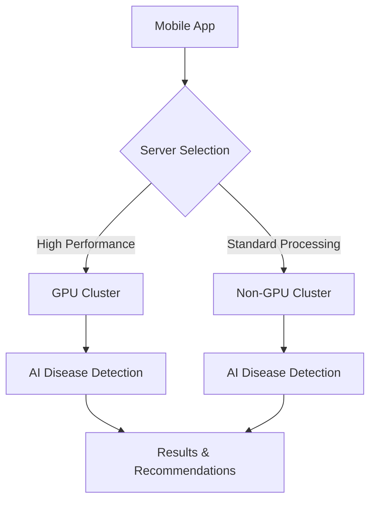

# 🌱 Sasya Arogya - Plant Disease Detection App

<div align="center">


*Revolutionizing agriculture through AI-powered plant disease detection*

[Features](#-features) • [Setup](#-setup) • [Build](#-build) • [Usage](#-usage) • [Architecture](#-architecture)

</div>

## 🌾 Overview

**Sasya Arogya** (Sanskrit for "Plant Health") is an advanced Android application that empowers farmers and agricultural professionals to detect and diagnose plant diseases using artificial intelligence. By simply capturing a photo of affected plant leaves, users receive instant, accurate disease identification and treatment recommendations.

### 🎯 Mission
To help farmers worldwide save crops, reduce losses, and improve agricultural productivity through accessible AI technology.

## ✨ Features

### 🔍 Core Functionality
- **📸 Instant Disease Detection** - Capture plant photos for immediate AI analysis
- **🎯 High Accuracy Diagnosis** - Advanced machine learning models for precise identification  
- **📊 Confidence Scoring** - Reliability indicators for each diagnosis
- **💡 Treatment Recommendations** - Actionable advice for disease management
- **📱 Offline Capability** - Works without internet connection

### 🌐 Dual Server Architecture
- **🚀 GPU Server** - High-performance processing for complex analysis
- **⚡ Non-GPU Server** - Efficient processing for standard detection
- **🔄 Automatic Switching** - Smart server selection based on availability

### 🎨 User Experience
- **🌿 Earth-Themed UI** - Beautiful, farmer-friendly interface design
- **💬 Chat Interface** - Intuitive conversation-based interaction
- **📷 Image Management** - Easy photo capture and preview
- **🔧 Server Configuration** - Flexible backend switching
- **📋 Session Management** - Track and review diagnosis history

### 🌍 Multi-Language Support
- **🔤 Agricultural Terminology** - Specialized vocabulary for farming
- **🌾 Crop-Specific Guidance** - Tailored advice for different plant types

## 🛠 Setup

### Prerequisites
- **Android Studio** - Latest stable version
- **Android SDK 34** - Target SDK level
- **Java 8+** - For Gradle compatibility
- **Git** - For version control

### 📥 Installation

1. **Clone the repository**
   ```bash
   git clone https://github.com/yourusername/sasya-arogya-app.git
   cd sasya-arogya-app
   ```

2. **Open in Android Studio**
   - Launch Android Studio
   - Select "Open an existing Android Studio project"
   - Navigate to the cloned directory
   - Wait for Gradle sync to complete

3. **Configure SDK Path**
   - Ensure Android SDK 34 is installed
   - Verify `local.properties` contains correct SDK path
   - Sync project with Gradle files

## 🔨 Build

### Build Variants

The app supports **two specialized build variants**:

#### 🚀 GPU Variant
Optimized for high-performance GPU cluster processing:
```bash
./gradlew assembleGpuDebug      # Debug build
./gradlew assembleGpuRelease    # Release build
```

#### ⚡ Non-GPU Variant  
Optimized for standard server processing:
```bash
./gradlew assembleNongpuDebug   # Debug build
./gradlew assembleNongpuRelease # Release build
```

### 🎯 Custom Build Tasks

```bash
# Build GPU release APK
./gradlew buildGpuRelease

# Build Non-GPU release APK  
./gradlew buildNonGpuRelease

# Build both variants
./gradlew buildAllReleaseVariants

# Copy APKs to releases/ directory with descriptive names
./gradlew copyReleasesToDistribution
```

### 📦 Output Structure
```
app/build/outputs/apk/
├── gpu/release/          # GPU-optimized APK
├── nongpu/release/       # Non-GPU APK
└── debug/               # Debug builds
```

## 📱 Usage

### Getting Started
1. **Install the App** - Deploy to Android device
2. **Select Server Type** - Choose GPU or Non-GPU processing
3. **Capture Image** - Photo plant leaves showing disease symptoms
4. **Receive Diagnosis** - Get AI-powered disease identification
5. **Follow Recommendations** - Apply suggested treatment strategies

### 🖼 Image Guidelines
- **📸 Clear photos** - Well-lit, focused images
- **🍃 Leaf focus** - Center affected leaves in frame  
- **🔍 Close-up shots** - Capture disease symptoms clearly
- **🌅 Good lighting** - Natural daylight preferred

### 💬 Chat Interface
- **Interactive Diagnosis** - Conversational disease analysis
- **📝 Follow-up Questions** - Additional guidance and clarification
- **👍👎 Feedback** - Rate diagnosis accuracy
- **📚 History** - Review past consultations

## 🏗 Architecture

### 🎯 Technical Stack
- **Language**: Kotlin
- **UI Framework**: Android Views with ViewBinding
- **Networking**: Retrofit2 + OkHttp3
- **Image Processing**: Android Camera2 API
- **Async Processing**: Kotlin Coroutines
- **Architecture**: MVVM pattern

### 🌐 Server Infrastructure



#### 🚀 GPU Cluster
- **URL**: `http://engine-sasya-chikitsa.apps.cluster-mqklc.mqklc.sandbox601.opentlc.com/`
- **Purpose**: Complex disease analysis requiring high computational power
- **Features**: Advanced ML models, faster processing

#### ⚡ Non-GPU Cluster  
- **URL**: `http://engine-sasya-chikitsa.apps.cluster-6twrd.6twrd.sandbox1818.opentlc.com/`
- **Purpose**: Standard disease detection for common cases
- **Features**: Efficient processing, reliable availability

### 📁 Project Structure
```
app/src/main/java/com/sasya/arogya/
├── 🎯 MainActivity.kt              # Main app entry point
├── 🤖 MainActivityFSM.kt          # Finite State Machine activity
├── config/
│   └── 🔧 ServerConfig.kt         # Server configuration
├── fsm/                           # Finite State Machine logic
│   ├── 💬 ChatAdapter.kt          # Chat interface adapter
│   ├── 📱 SessionManager.kt       # Session management
│   ├── 🌐 FSMApiService.kt        # API service interface
│   └── 🔄 FSMStreamHandler.kt     # Real-time data handling
├── network/                       # Networking components
│   ├── 🌍 ApiService.kt           # REST API definitions
│   └── 🏗 RetrofitClient.kt       # HTTP client setup
└── utils/
    └── 📝 TextFormattingUtil.kt   # UI text utilities
```

## 🌍 Supported Diseases

### 🍎 Apple Diseases
- **Alternaria Early Blight** - Fungal infection causing leaf spots
- **Apple Mosaic Virus** - Viral disease affecting leaf patterns
- **Tomato Mosaic Virus** - Cross-contamination viral infection

### 🍆 Eggplant Diseases  
- **Leaf Spot** - Bacterial/fungal leaf infection
- **Mosaic Virus** - Viral disease causing leaf mottling

### 🥔 Potato Diseases
- **Fungal Infections** - Various fungal leaf diseases
- **Healthy Detection** - Verification of healthy plants

### 🍅 Tomato Diseases
- **Fruit Borer** - Insect pest damage
- **Spider Mites** - Microscopic pest infestation  
- **Target Spot** - Fungal leaf disease
- **Yellow Leaf Curl Virus** - Viral infection

## 🔧 Development

### 📋 Prerequisites
- **Android API Level**: 24+ (Android 7.0+)
- **Target SDK**: 34 (Android 14)
- **Build Tools**: 34.0.0
- **Gradle**: 8.4
- **Android Gradle Plugin**: 8.12.3

### 🎨 UI Theme
The app features a beautiful **earth-themed design**:
- **🌲 Forest Greens**: Primary colors for nature connection
- **🌿 Sage Tones**: Secondary colors for calm user experience  
- **🍯 Warm Ambers**: Accent colors for important actions
- **🌾 Earth Browns**: Text and background for readability

### 📱 Build Variants Configuration

#### Debug Configuration
- **Local Server**: `http://10.0.2.2:8080/` (Android Emulator)
- **Debugging**: Full debug information enabled
- **Logging**: Detailed network and app logs

#### Release Configuration
- **Production Servers**: Live cluster endpoints
- **Optimization**: Code shrinking and obfuscation
- **Security**: Release-ready certificates

## 🤝 Contributing

We welcome contributions to improve plant disease detection! 

### 🌱 How to Contribute
1. **Fork the repository**
2. **Create feature branch** (`git checkout -b feature/amazing-feature`)
3. **Commit changes** (`git commit -m 'Add amazing feature'`)
4. **Push to branch** (`git push origin feature/amazing-feature`)
5. **Open Pull Request**

### 🐛 Bug Reports
- Use GitHub Issues for bug reports
- Include device information and Android version
- Provide steps to reproduce the issue
- Attach relevant screenshots or logs

### 💡 Feature Requests
- Suggest new plant diseases to detect
- Propose UI/UX improvements
- Request additional language support
- Share ideas for farmer-friendly features

## 📄 License

This project is licensed under the **MIT License** - see the [LICENSE](LICENSE) file for details.

## 🙏 Acknowledgments

- **🌾 Farmers worldwide** - For inspiring this agricultural innovation
- **🤖 AI/ML Community** - For advancing plant disease detection research  
- **🌱 Agricultural Scientists** - For providing disease classification expertise
- **📱 Android Community** - For excellent development tools and resources

## 📞 Support

### 🆘 Getting Help
- **📖 Documentation**: Check this README and inline code comments
- **🐛 Issues**: Report bugs via GitHub Issues  
- **💬 Discussions**: Join GitHub Discussions for questions
- **📧 Contact**: Reach out for agricultural partnerships

### 🌐 Resources
- **Android Development**: [developer.android.com](https://developer.android.com)
- **Plant Disease Research**: Agricultural science journals and papers
- **Machine Learning**: TensorFlow and PyTorch communities

---

<div align="center">

### 🌱 Help Save Crops Worldwide! 🌍

**Made with ❤️ for farmers and agricultural innovation**

[⭐ Star this repo](../../stargazers) • [🍴 Fork it](../../network/members) • [📢 Share it](https://twitter.com/intent/tweet?text=Check%20out%20Sasya%20Arogya%20-%20AI-powered%20plant%20disease%20detection%20app!)

</div>
