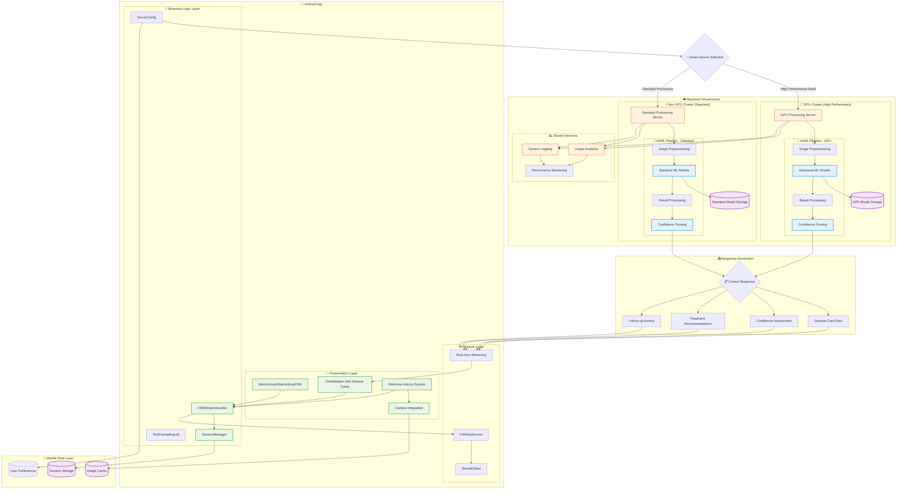
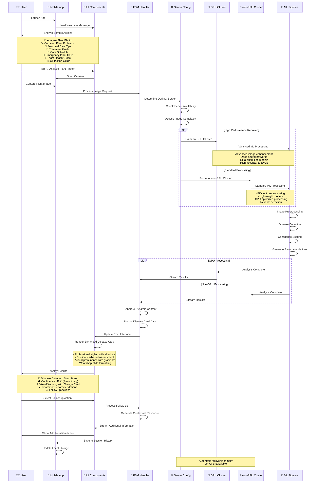

# 🌱 Sasya Arogya - Plant Disease Detection App

<div align="center">


*Revolutionizing agriculture through AI-powered plant disease detection*

[Features](#-features) • [Setup](#-setup) • [Build](#-build) • [Usage](#-usage) • [Architecture](#-architecture)

</div>

## 🌾 Overview

**Sasya Arogya** (Sanskrit for "Plant Health") is an advanced Android application that empowers farmers and agricultural professionals to detect and diagnose plant diseases using artificial intelligence. By simply capturing a photo of affected plant leaves, users receive instant, accurate disease identification and treatment recommendations.

### 🎯 Mission
To help farmers worldwide save crops, reduce losses, and improve agricultural productivity through accessible AI technology.

## ✨ Features

### 🔍 Core Functionality
- **📸 Instant Disease Detection** - Capture plant photos for immediate AI analysis
- **🎯 High Accuracy Diagnosis** - Advanced machine learning models with confidence-based assessments
- **📊 Intelligent Confidence Scoring** - Four-tier reliability system (High/Moderate/Preliminary/Initial)
- **💡 Dynamic Treatment Recommendations** - Contextual advice based on disease type and severity
- **🌟 Enhanced Visual Cards** - Professionally styled disease cards with prominent visual indicators
- **📝 Smart Content Generation** - Generic system that works with any plant disease automatically

### 🌐 Dual Server Architecture
- **🚀 GPU Server** - High-performance processing for complex analysis
- **⚡ Non-GPU Server** - Efficient processing for standard detection
- **🔄 Automatic Switching** - Smart server selection based on availability

### 🎨 User Experience
- **🌿 Earth-Themed UI** - Beautiful, farmer-friendly interface design with WhatsApp-style messaging
- **💬 Enhanced Chat Interface** - Professional conversation-based interaction with intelligent responses
- **🚀 Welcome Actions** - 8 sample clickable actions for immediate user engagement
- **📸 Smart Photo Analysis** - One-tap image capture with direct analysis integration
- **🎯 Dynamic Content** - Contextual disease information based on confidence levels
- **🔧 Server Configuration** - Flexible backend switching with automatic failover
- **📋 Session Management** - Track and review comprehensive diagnosis history

### 🌍 Multi-Language Support
- **🔤 Agricultural Terminology** - Specialized vocabulary for farming
- **🌾 Crop-Specific Guidance** - Tailored advice for different plant types

## 🛠 Setup

### Prerequisites
- **Android Studio** - Latest stable version
- **Android SDK 34** - Target SDK level
- **Java 8+** - For Gradle compatibility
- **Git** - For version control

### 📥 Installation

1. **Clone the repository**
   ```bash
   git clone https://github.com/yourusername/sasya-arogya-app.git
   cd sasya-arogya-app
   ```

2. **Open in Android Studio**
   - Launch Android Studio
   - Select "Open an existing Android Studio project"
   - Navigate to the cloned directory
   - Wait for Gradle sync to complete

3. **Configure SDK Path**
   - Ensure Android SDK 34 is installed
   - Verify `local.properties` contains correct SDK path
   - Sync project with Gradle files

## 🔨 Build

### Build Variants

The app supports **two specialized build variants**:

#### 🚀 GPU Variant
Optimized for high-performance GPU cluster processing:
```bash
./gradlew assembleGpuDebug      # Debug build
./gradlew assembleGpuRelease    # Release build
```

#### ⚡ Non-GPU Variant  
Optimized for standard server processing:
```bash
./gradlew assembleNongpuDebug   # Debug build
./gradlew assembleNongpuRelease # Release build
```

### 🎯 Custom Build Tasks

```bash
# Build GPU release APK
./gradlew buildGpuRelease

# Build Non-GPU release APK  
./gradlew buildNonGpuRelease

# Build both variants
./gradlew buildAllReleaseVariants

# Copy APKs to releases/ directory with descriptive names
./gradlew copyReleasesToDistribution
```

### 📦 Output Structure
```
app/build/outputs/apk/
├── gpu/release/          # GPU-optimized APK
├── nongpu/release/       # Non-GPU APK
└── debug/               # Debug builds
```

## 📱 Usage

### Getting Started
1. **Install the App** - Deploy to Android device or emulator
2. **Welcome Experience** - Choose from 8 professional sample actions to get started instantly
3. **Quick Photo Analysis** - Tap "📸 Analyze Plant Photo" for immediate camera access
4. **Smart Server Selection** - App automatically chooses optimal GPU/Non-GPU processing
5. **Enhanced Diagnosis** - Receive AI-powered identification with confidence-based assessments
6. **Visual Disease Cards** - View results in professionally styled cards with prominent visuals
7. **Dynamic Recommendations** - Get contextual treatment advice based on detected condition

### 🖼 Image Guidelines
- **📸 Clear photos** - Well-lit, focused images
- **🍃 Leaf focus** - Center affected leaves in frame  
- **🔍 Close-up shots** - Capture disease symptoms clearly
- **🌅 Good lighting** - Natural daylight preferred

### 💬 Enhanced Chat Interface
- **🚀 Welcome Actions** - Professional sample actions: Analyze Photo, Common Problems, Seasonal Care, etc.
- **📱 Interactive Diagnosis** - WhatsApp-style conversational disease analysis
- **🎨 Visual Disease Cards** - Enhanced styling with drop shadows, gradients, and prominent borders
- **📊 Dynamic Content** - Intelligent introductions based on disease classification and confidence
- **📝 Smart Formatting** - Proper **bold text** display without markdown symbols
- **👍👎 Feedback System** - Comprehensive rating system for diagnosis accuracy
- **📚 Session History** - Complete consultation tracking with visual context

## 🏗 Architecture

### 🎯 Technical Stack
- **Language**: Kotlin
- **UI Framework**: Android Views with ViewBinding
- **Networking**: Retrofit2 + OkHttp3
- **Image Processing**: Android Camera2 API
- **Async Processing**: Kotlin Coroutines
- **Architecture**: MVVM pattern

### 🏗 Comprehensive System Architecture



### 🌐 Detailed Component Architecture

#### 📱 **Mobile App Layer (Android)**

##### 🎨 **Presentation Layer**
- **`MainActivity/MainActivityFSM`** - Main application entry points with FSM-based intelligent chat interface
- **`ChatAdapter with Disease Cards`** - Advanced RecyclerView adapter rendering WhatsApp-style messages with enhanced visual disease cards
- **`Welcome Actions System`** - Professional sample actions for immediate user engagement (8 strategic buttons)
- **`Camera Integration`** - Direct photo capture with seamless analysis workflow

##### 💼 **Business Logic Layer**  
- **`FSMStreamHandler`** - Finite State Machine managing real-time streaming responses and state transitions
- **`SessionManager`** - Comprehensive session management with persistent storage and conversation history
- **`ServerConfig`** - Smart server selection logic with automatic failover between GPU/Non-GPU clusters
- **`TextFormattingUtil`** - WhatsApp-style text formatting for proper **bold text** rendering

##### 🌐 **Network Layer**
- **`RetrofitClient`** - HTTP client with customizable server endpoints and connection management
- **`FSMApiService`** - RESTful API interface definitions for disease detection and streaming responses
- **`Real-time Streaming`** - WebSocket-like streaming for live AI analysis updates and progress indicators

#### ☁️ **Backend Infrastructure**

##### 🚀 **GPU Cluster (High Performance)**
- **URL**: `http://engine-sasya-chikitsa.apps.cluster-mqklc.mqklc.sandbox601.opentlc.com/`
- **Purpose**: Complex disease analysis requiring high computational power
- **ML Pipeline**:
  - **Image Preprocessing**: Advanced image enhancement, normalization, and augmentation
  - **Advanced ML Models**: Deep neural networks optimized for GPU processing
  - **Result Processing**: Sophisticated post-processing with confidence calibration
  - **Confidence Scoring**: Multi-layer confidence assessment with uncertainty quantification
- **Features**: Faster processing, higher accuracy, support for complex diseases

##### ⚡ **Non-GPU Cluster (Standard Processing)**
- **URL**: `http://engine-sasya-chikitsa.apps.cluster-6twrd.6twrd.sandbox1818.opentlc.com/`
- **Purpose**: Standard disease detection for common cases with reliable availability
- **ML Pipeline**:
  - **Image Preprocessing**: Efficient image processing optimized for CPU
  - **Standard ML Models**: Lightweight models for common disease detection
  - **Result Processing**: Fast result generation with standard confidence metrics
  - **Confidence Scoring**: Reliable confidence assessment for standard cases
- **Features**: Consistent availability, efficient processing, reliable for common diseases

##### 📊 **Shared Backend Services**
- **`Usage Analytics`** - Comprehensive usage tracking, disease detection statistics, and performance metrics
- **`System Logging`** - Centralized logging for debugging, error tracking, and system monitoring
- **`Performance Monitoring`** - Real-time system performance tracking with alerting and optimization

#### 🔄 **Data Flow Architecture**

##### 📤 **Request Flow**
1. **User Action** → Welcome actions or direct photo upload
2. **Smart Server Selection** → Config determines optimal GPU/Non-GPU cluster based on:
   - Server availability and response times
   - Image complexity and processing requirements  
   - User preferences and historical performance
3. **Image Processing** → Multi-stage ML pipeline execution
4. **Response Generation** → Structured data formatting for mobile consumption

##### 📥 **Response Flow** 
1. **Disease Card Data** → Structured disease information with confidence metrics
2. **Confidence Assessment** → Four-tier confidence system (High/Moderate/Preliminary/Initial)
3. **Treatment Recommendations** → Contextual advice based on disease type and severity
4. **Follow-up Actions** → Dynamic action suggestions for continued user engagement
5. **Real-time Streaming** → Progressive response delivery for better user experience

#### 💾 **Data Persistence Layer**

##### 📱 **Mobile Storage**
- **`Session Storage`** - Complete conversation history with disease cards and user interactions
- **`Image Cache`** - Efficient local caching of captured and processed images
- **`User Preferences`** - Server selection preferences, user profile, and application settings

##### ☁️ **Backend Storage**  
- **`GPU Model Storage`** - Advanced ML models optimized for GPU processing
- **`Standard Model Storage`** - Lightweight ML models for standard CPU processing
- **`Analytics Database`** - Usage patterns, disease detection statistics, and system performance data

#### 🔒 **Security & Reliability**

##### 🛡️ **Security Features**
- **HTTPS Communication** - All API calls encrypted with TLS
- **Image Data Privacy** - Images processed and not permanently stored on servers
- **Session Security** - Secure session management with proper authentication
- **API Rate Limiting** - Protection against abuse and ensuring fair usage

##### 🔄 **Reliability Features**
- **Automatic Failover** - Smart switching between GPU/Non-GPU clusters
- **Retry Logic** - Automatic retry with exponential backoff for network failures
- **Offline Capability** - Local session storage and graceful degradation
- **Performance Monitoring** - Continuous system health monitoring with alerting

### 🔄 **Disease Detection Workflow**



### 🎯 **Key Workflow Features**

#### 🚀 **Smart Server Selection Logic**
- **Performance Assessment**: Evaluates image complexity and processing requirements
- **Availability Monitoring**: Real-time server health and response time tracking  
- **Automatic Failover**: Seamless switching between GPU and Non-GPU clusters
- **User Experience**: Transparent server selection - users always get optimal processing

#### 📊 **Four-Tier Confidence System**
- **High Confidence (≥80%)** → ⚠️ Immediate action recommended with prominent red styling
- **Moderate Confidence (≥60%)** → 📋 Monitor closely with orange warning indicators
- **Preliminary (≥40%)** → 🔍 Continue monitoring with yellow caution styling  
- **Initial Assessment (<40%)** → ❓ Consider additional consultation with blue info styling

#### 🎨 **Enhanced Visual Feedback**
- **Dynamic Content Generation**: Contextual introductions based on disease classification
- **Professional Disease Cards**: Material Design elevation with drop shadows and gradients
- **WhatsApp-Style Formatting**: Proper **bold text** rendering without markdown symbols
- **Optimal Layout**: Wider containers (90% width utilization) for better visual impact

### 📁 Project Structure
```
app/src/main/java/com/sasya/arogya/
├── 🎯 MainActivity.kt              # Main app entry point  
├── 🤖 MainActivityFSM.kt          # Enhanced FSM activity with welcome actions
├── config/
│   └── 🔧 ServerConfig.kt         # Server configuration management
├── fsm/                           # Enhanced Finite State Machine logic
│   ├── 💬 ChatAdapter.kt          # Advanced chat interface with visual disease cards
│   ├── 📱 SessionManager.kt       # Comprehensive session management
│   ├── 🌐 FSMApiService.kt        # API service interface
│   └── 🔄 FSMStreamHandler.kt     # Real-time streaming data handling
├── network/                       # Networking components
│   ├── 🌍 ApiService.kt           # REST API definitions
│   └── 🏗 RetrofitClient.kt       # HTTP client setup
└── utils/
    └── 📝 TextFormattingUtil.kt   # WhatsApp-style text formatting utilities
```

## 🌍 Supported Diseases

### 🍎 Apple Diseases
- **Alternaria Early Blight** - Fungal infection causing leaf spots
- **Apple Mosaic Virus** - Viral disease affecting leaf patterns
- **Tomato Mosaic Virus** - Cross-contamination viral infection

### 🍆 Eggplant Diseases  
- **Leaf Spot** - Bacterial/fungal leaf infection
- **Mosaic Virus** - Viral disease causing leaf mottling

### 🥔 Potato Diseases
- **Fungal Infections** - Various fungal leaf diseases
- **Healthy Detection** - Verification of healthy plants

### 🍅 Tomato Diseases
- **Fruit Borer** - Insect pest damage
- **Spider Mites** - Microscopic pest infestation  
- **Target Spot** - Fungal leaf disease
- **Yellow Leaf Curl Virus** - Viral infection

## 🔧 Development

### 📋 Prerequisites
- **Android API Level**: 24+ (Android 7.0+)
- **Target SDK**: 34 (Android 14)
- **Build Tools**: 34.0.0
- **Gradle**: 8.4
- **Android Gradle Plugin**: 8.12.3

### 🎨 Recent Major Enhancements

#### 🚀 Welcome Message System
- **Professional Sample Actions**: 8 strategically designed clickable actions
- **Intelligent Response Handling**: Contextual AI responses for each action type
- **Direct Integration**: Photo analysis button immediately opens camera
- **User Engagement**: Modern AI app standards with immediate value delivery

#### 🎯 Enhanced Disease Cards
- **Visual Prominence**: Drop shadows, gradients, and enhanced borders
- **Material Design**: CardView elevation with proper depth perception  
- **Improved Warning Icons**: Gradient backgrounds with enhanced shadows
- **Optimal Proportions**: Wider layout eliminating elongated appearance

#### 🧠 Dynamic Content Generation
- **Generic System**: Single maintainable approach for all disease types
- **Confidence-Based Assessments**: Four-tier system (High/Moderate/Preliminary/Initial)  
- **Intelligent Introductions**: Contextual content eliminating empty space
- **Spread Prevention Focus**: Educational content relevant for all conditions
- **Zero Maintenance**: No code updates needed when new diseases are added
- **WhatsApp-Style Formatting**: Proper **bold text** rendering with TextFormattingUtil

#### 📐 Layout & Visual Improvements  
- **Wider Disease Containers**: Optimized margins (8dp/48dp → 4dp/16dp) for better proportions
- **Enhanced Backgrounds**: Multi-layer design with drop shadows and warm tinting (#FFF3E0)
- **CardView Integration**: Material Design elevation with proper depth perception
- **Optimal Space Usage**: ~90% width utilization vs previous ~60%

### 🎨 Enhanced UI Theme
The app features a beautiful **earth-themed design** with **WhatsApp-style messaging**:
- **🌲 Forest Greens**: Primary colors for nature connection and healthy plant indicators
- **🌿 Sage Tones**: Secondary colors for calm user experience and follow-up actions
- **🍊 Orange Gradients**: Enhanced disease card borders (#FF7043 → #FF5722) for visual prominence
- **🍯 Warm Ambers**: Accent colors for important actions and confidence indicators
- **🌾 Earth Browns**: Professional text and background for optimal readability
- **🎨 Modern Styling**: WhatsApp-inspired message bubbles with proper **bold formatting**

### 📱 Build Variants Configuration

#### Debug Configuration
- **Local Server**: `http://10.0.2.2:8080/` (Android Emulator)
- **Debugging**: Full debug information enabled
- **Logging**: Detailed network and app logs

#### Release Configuration
- **Production Servers**: Live cluster endpoints
- **Optimization**: Code shrinking and obfuscation
- **Security**: Release-ready certificates

## 🤝 Contributing

We welcome contributions to improve plant disease detection! 

### 🌱 How to Contribute
1. **Fork the repository**
2. **Create feature branch** (`git checkout -b feature/amazing-feature`)
3. **Commit changes** (`git commit -m 'Add amazing feature'`)
4. **Push to branch** (`git push origin feature/amazing-feature`)
5. **Open Pull Request**

### 🐛 Bug Reports
- Use GitHub Issues for bug reports
- Include device information and Android version
- Provide steps to reproduce the issue
- Attach relevant screenshots or logs

### 💡 Feature Requests
- Suggest new plant diseases to detect
- Propose UI/UX improvements
- Request additional language support
- Share ideas for farmer-friendly features

## 📄 License

This project is licensed under the **MIT License** - see the [LICENSE](LICENSE) file for details.

## 🙏 Acknowledgments

- **🌾 Farmers worldwide** - For inspiring this agricultural innovation
- **🤖 AI/ML Community** - For advancing plant disease detection research  
- **🌱 Agricultural Scientists** - For providing disease classification expertise
- **📱 Android Community** - For excellent development tools and resources

## 📞 Support

### 🆘 Getting Help
- **📖 Documentation**: Check this README and inline code comments
- **🐛 Issues**: Report bugs via GitHub Issues  
- **💬 Discussions**: Join GitHub Discussions for questions
- **📧 Contact**: Reach out for agricultural partnerships

### 🌐 Resources
- **Android Development**: [developer.android.com](https://developer.android.com)
- **Plant Disease Research**: Agricultural science journals and papers
- **Machine Learning**: TensorFlow and PyTorch communities

---

<div align="center">

### 🌱 Help Save Crops Worldwide! 🌍

**Made with ❤️ for farmers and agricultural innovation**

[⭐ Star this repo](../../stargazers) • [🍴 Fork it](../../network/members) • [📢 Share it](https://twitter.com/intent/tweet?text=Check%20out%20Sasya%20Arogya%20-%20AI-powered%20plant%20disease%20detection%20app!)

</div>
